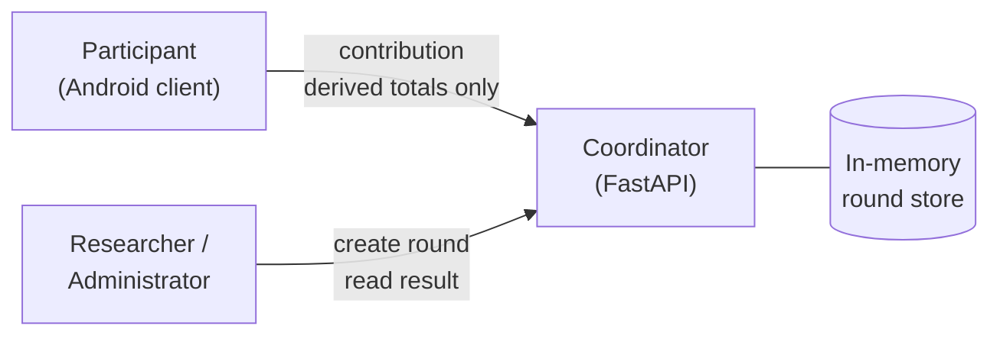
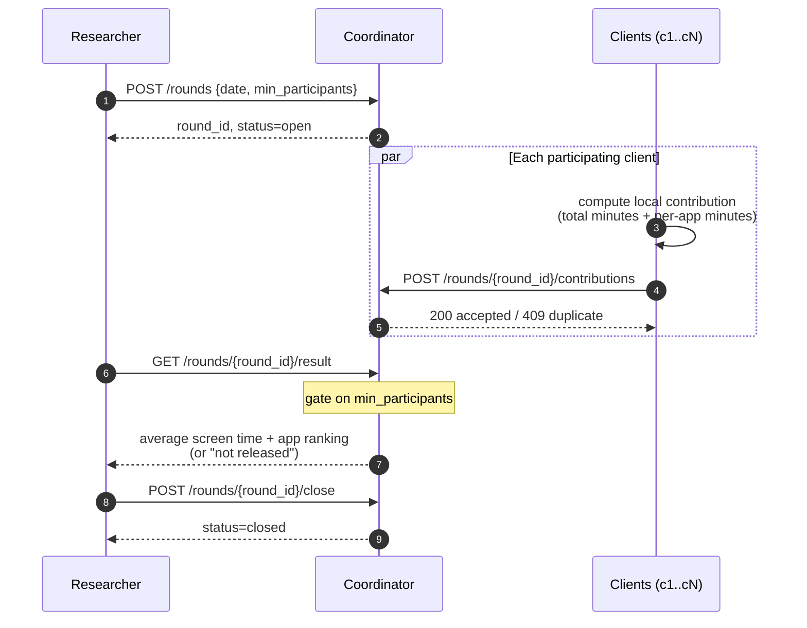

# Family Screen-Time Federated Analytics

A research-oriented Federated Analytics (FA) prototype that computes group-level screen-time statistics across family
members without sending raw per-app usage history to a central server.

> **Status:** experimental prototype. Not a production-ready privacy product. Basic FA alone does **not** hide
> individual contributions from the coordinator.

---

## 1. What this is

- Participants (Android devices, simulated for now) compute usage totals **locally**.
- Only derived totals leave the device: daily total screen time + per-app minutes.
- A FastAPI coordinator collects contributions and releases **group-level** results.
- Later milestones add **secure aggregation** and optional **differential privacy**.

## 2. What this is not

- Not a production system.
- Not a privacy guarantee. Basic FA still reveals individual totals to the coordinator.
- Not Federated Learning (no model training).
- No iOS support in v1.
- No reading of messages, contacts, or browsing history.

---

## 3. System context



- **Participant** opts in, grants Usage Access, runs the client.
- **Client** computes local contribution; raw events never leave the device.
- **Coordinator** orchestrates rounds and aggregates contributions.
- **Researcher** creates rounds, triggers aggregation, inspects results.

---

## 4. One analytics round (basic FA)



**Basic FA limitation:** the coordinator sees each client's individual totals. Secure aggregation (later milestone)
hides these from the coordinator.

---

## 5. Repository layout

```
.
├── main.py                     # FastAPI app entry
├── models.py                   # Pydantic request/response models
├── store.py                    # In-memory round store
├── services/
│   └── round_service.py        # Business logic (create, submit, aggregate)
├── controllers/
│   └── round_controller.py     # Domain <-> HTTP translation
├── routes/
│   └── round_routes.py         # HTTP endpoints
├── tests/
│   └── test_rounds.py          # pytest end-to-end tests
├── docs/
│   └── architecture/
│       ├── README.md
│       ├── components.md
│       └── data-contract.md
└── requirements.txt
```

Layering rule:

- **routes** — HTTP only, no business logic
- **controllers** — request/response shape translation
- **services** — all business rules, no FastAPI imports
- **store** — raw in-memory persistence

---

## 6. API

| Method | Path                               | Purpose                                        |
| ------ | ---------------------------------- | ---------------------------------------------- |
| `POST` | `/rounds`                          | Create a new analytics round                   |
| `POST` | `/rounds/{round_id}/contributions` | A client submits its local contribution        |
| `GET`  | `/rounds/{round_id}`               | Round status (received count, valid clients)   |
| `GET`  | `/rounds/{round_id}/result`        | Group-level result (gated by min_participants) |
| `POST` | `/rounds/{round_id}/close`         | Freeze the round (no further submissions)      |

Interactive docs: `http://127.0.0.1:8000/docs`

---

## 7. Contribution data contract (what leaves the device)

```json
{
  "client_id": "c1",
  "date": "2026-09-29",
  "total_screen_time_minutes": 247,
  "app_usage_minutes": {
    "com.example.chat": 83,
    "com.example.video": 61
  }
}
```

Only derived totals are sent. Raw event-level history stays on the device.

---

## 8. Running locally

```bash
python -m venv .venv
source .venv/Scripts/activate      # Windows: .venv\Scripts\activate
pip install -r requirements.txt
uvicorn main:app --reload
```

Then open <http://127.0.0.1:8000/docs>.

### Tests

```bash
pytest -v
```

---

## 9. Definition of a "valid participant"

- Has submitted **once** for the round's date.
- Has not been duplicated (duplicate `client_id` is rejected).
- Was **not treated as zero** because it was offline or missing.
- Counted in the denominator only when it produced a valid contribution.

---

## 10. Roadmap (abridged)

1. Definitions (metrics, reporting day, "most-used" meaning)
2. Synthetic dataset for 20 clients
3. Centralized baseline for comparison
4. Basic FA end-to-end ✅
5. Automated tests ✅
6. Android client (consent-first, Usage Access)
7. Secure aggregation
8. Differential privacy experiment
9. Evaluation across versions

---

## 11. Privacy notes

- **Consent-first.** Participation is voluntary and understandable.
- **Data minimization.** Only fields needed for the query are collected.
- **Small groups.** Results are suppressed when fewer than `min_participants` contribute.
- **Not a guarantee.** Basic FA does not hide individual contributions from the coordinator; secure aggregation and DP
  are separate, later milestones.

See `docs/architecture/` for component and data-contract diagrams.
