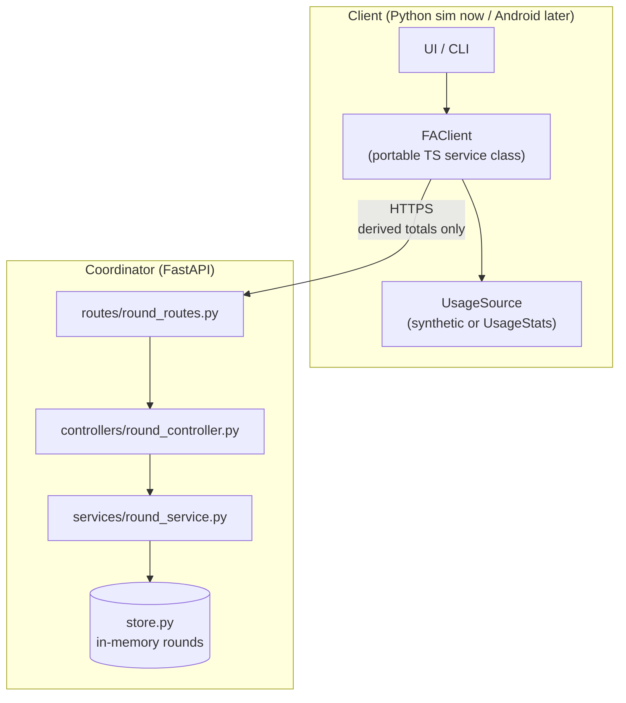

# Components

## Container view

## Folder mapping

| Component                     | File                                |
| ----------------------------- | ----------------------------------- |
| HTTP endpoints                | `routes/round_routes.py`            |
| Request/response shaping      | `controllers/round_controller.py`   |
| Business rules & aggregation  | `services/round_service.py`         |
| Persistence                   | `store.py`                          |
| Domain models                 | `models.py`                         |
| Client service class (later)  | `client-ts/src/fa/client.ts`        |
| Platform usage source (later) | `mobile/src/platform/UsageStats.ts` |

## Layer rules

- Routes never touch the store directly.
- Controllers never contain business rules.
- Services never import FastAPI.
- The client's `UsageSource` is the **only** piece that changes between the synthetic simulator and a real Android
  device.
