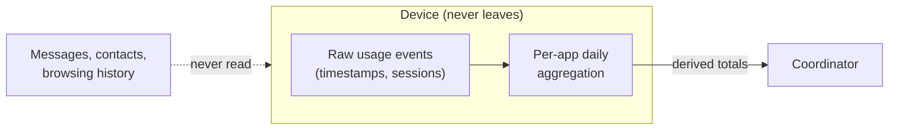

# Data contract

## What a client sends

```json
{
  "client_id": "c1",
  "date": "2026-09-29",
  "total_screen_time_minutes": 247,
  "app_usage_minutes": {
    "com.example.chat": 83,
    "com.example.video": 61
  }
}
```

## What stays on the device



## Field reference

| Field                       | Type                    | Notes                                                 |
| --------------------------- | ----------------------- | ----------------------------------------------------- |
| `client_id`                 | string                  | Stable per participant; must be unique within a round |
| `date`                      | `YYYY-MM-DD`            | Must match the round's date                           |
| `total_screen_time_minutes` | number ≥ 0              | Derived locally                                       |
| `app_usage_minutes`         | map<app_id, number ≥ 0> | Per-app totals in minutes                             |

## Privacy properties

- No raw events, sessions, or timestamps are transmitted.
- Only the derived totals above leave the device.
- **Basic FA:** the coordinator still sees each client's totals.
- **Secure aggregation (later):** individual totals hidden from the coordinator.
- **Differential privacy (later):** calibrated noise on released aggregates.
